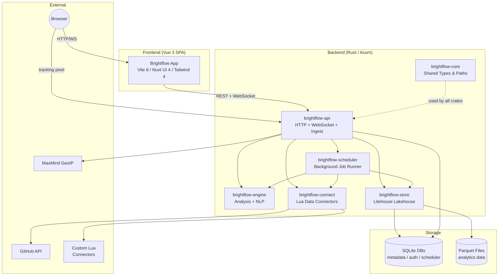
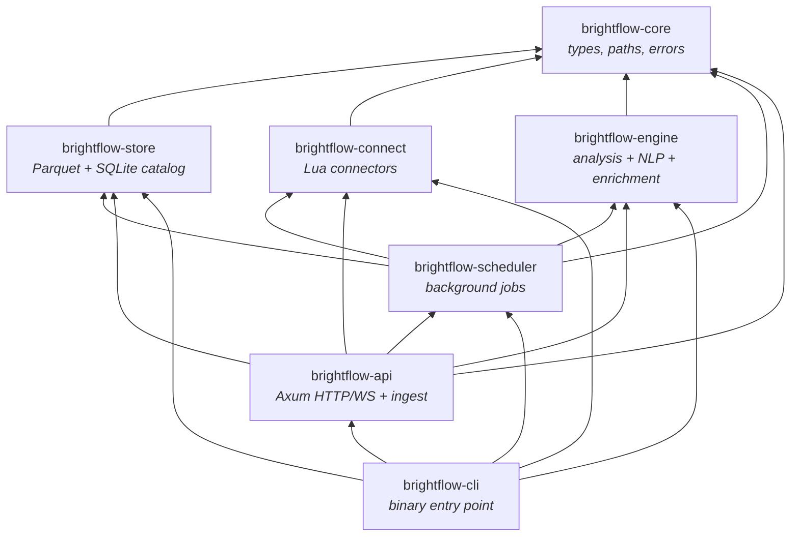
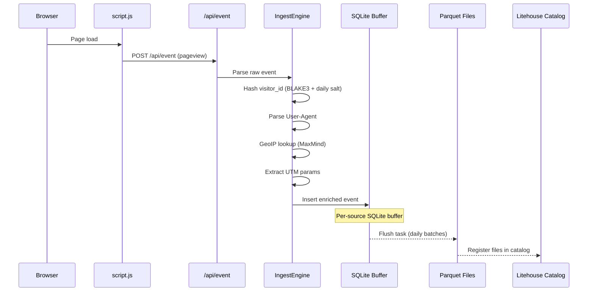
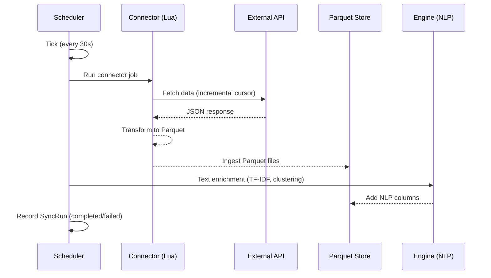
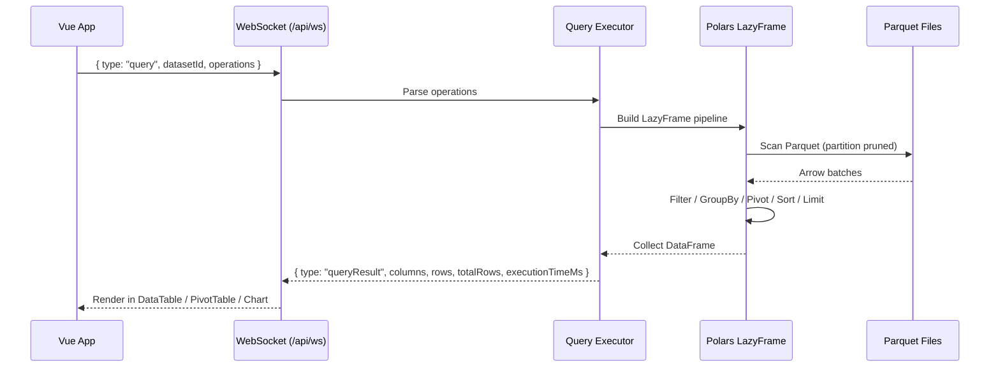
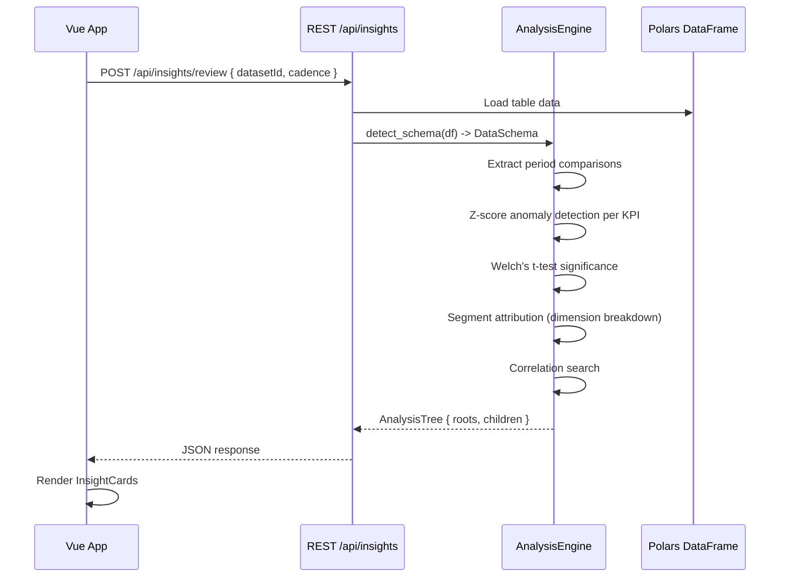
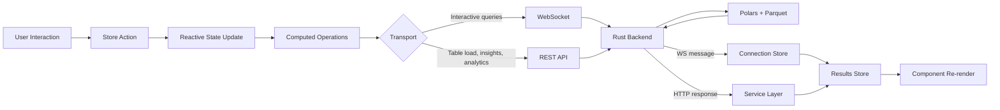
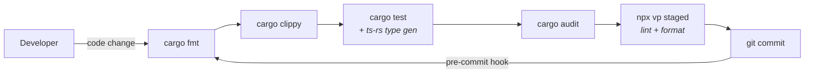

# Brightflow Architecture

Brightflow is a self-hosted analytics platform with a Rust backend and Vue 3 frontend. It combines web analytics, product analytics, data connector syncing, and statistical insight generation into a single system.

---

## System Overview



---

## Crate Dependency Graph

The workspace contains 6 Rust crates organized in layers.



---

## Crate Descriptions

### brightflow-core

Foundation crate. Defines `WorkspacePaths` (resolves all file/DB locations with environment variable overrides), `BrightflowError`, and shared newtypes. Every other crate depends on it.

Key paths resolved:
- `store()` -- directory for Parquet data files
- `litehouse_url()` -- SQLite metadata catalog
- `auth_url()` -- user/session database
- `scheduler_url()` -- scheduler jobs database
- `events_store()` -- per-source/date event Parquet files
- `events_buffer()` -- per-source SQLite write buffers
- `connector_configs()` -- custom Lua connector directory

### brightflow-store (Litehouse)

A lakehouse engine: SQLite catalog + Parquet data files. The SQLite database tracks table metadata (name, schema, row count, partition columns, source_id), file registrations (path, row count, size), column semantics (role, KPI flag, label), and per-file column statistics (min/max/null_count).

Operations: ingest (append/overwrite), merge (upsert by primary keys), compact (consolidate partition files), scan (partition-pruned reads via Polars LazyFrame), register (idempotent file catalog entry).

### brightflow-connect

Lua-based data connector framework. Ships a built-in GitHub connector (embedded at compile time) and discovers custom `.lua` files from disk. Connectors support incremental sync via cursor tracking, dry-run mode, and per-endpoint filtering. The `longbow` crate (external sibling dependency) provides the Lua runtime.

### brightflow-engine

Unified analysis and data processing crate. Contains three major subsystems:

- **`analysis/`** -- Statistical analysis engine operating on Polars DataFrames with auto-detected or user-configured schemas (measures, dimensions, time columns). Three analysis modes: Review (anomaly detection with z-score/Welch's t-test, segment attribution, correlation search), Trends (time-series slope detection, seasonality, forecasting), and Drivers (composition analysis). Results are hierarchical (`AnalysisTree`) and render to JSON, Markdown, or HTML.

- **`nlp/`** -- NLP primitives: tokenization (code-aware preset), TF-IDF model fitting, sparse vector operations, cosine similarity, n-gram generation, and k-means clustering. Includes Polars integration for DataFrame column enrichment (topic clustering, label prediction).

- **`enrichment/`** -- Orchestration layer for text enrichment. Defines which tables are enrichable, manages model persistence paths, and provides `enrich_with_existing_model()` for DataFrame-in/DataFrame-out enrichment. Used by both the scheduler (post-sync) and CLI (`enrich` command).

### brightflow-scheduler

Background job runner. Ticks every 30 seconds, checks enabled jobs, spawns async connector runs. Records `SyncRun` status (running/completed/failed) with output paths. Post-processing uses `brightflow-engine::enrichment` for NLP text enrichment and Parquet ingestion into the store.

### brightflow-api

Axum HTTP + WebSocket server with integrated event ingestion. Central orchestrator that wires together all other crates. Shared state (`AppState`) holds lazy-loaded datasets, the Parquet store, schema caches, scheduler, auth DB, ingest engine, and a broadcast channel for log streaming.

The **ingest module** (`api::ingest`) handles web and product analytics event collection. It receives raw events from a tracking script or API calls, enriches them (visitor hashing via BLAKE3 + daily salt, User-Agent parsing, GeoIP lookup, UTM extraction), buffers into per-source SQLite databases, and flushes to daily Parquet files registered in the store catalog.

### brightflow-cli

Binary entry point (`brightflow`). Provides CLI commands: `serve`/`run-all`, `insights` (review/trends/drivers), `connect list`, `store` (list/info/ingest/export/delete), `create-admin`, `enrich` (NLP columns), `migrate-events`, `compact`. Uses jemalloc with aggressive memory return.

---

## Data Flow

### 1. Web Analytics Event Ingestion



Each event is enriched with: visitor_id (hashed), session_id (derived), browser/OS/device (parsed UA), country/region/city (GeoIP), referrer source classification, and UTM parameters.

### 2. Connector Sync Pipeline



### 3. Interactive Query Execution



Query operations are composable: Filter, Select, GroupBy (with aggregations), Pivot, Sort, Limit. They are applied as a Polars LazyFrame pipeline and materialized on `.collect()`.

### 4. Insights Analysis Pipeline



---

## API Surface

### Authentication (Public)
| Method | Path | Description |
|--------|------|-------------|
| POST | `/api/auth/login` | Session-based login (Argon2 password verification) |
| POST | `/api/auth/logout` | End session |
| GET | `/api/auth/me` | Current authenticated user |

### Data Tables (Protected)
| Method | Path | Description |
|--------|------|-------------|
| GET | `/api/tables` | List available Parquet tables (metadata only) |
| POST | `/api/tables/{name}/load` | Lazy-load a table into memory |
| GET | `/api/datasets` | List loaded datasets |
| POST | `/api/datasets/upload` | Upload CSV file |
| POST | `/api/query` | Execute query on dataset (REST fallback) |

### Column Semantics (Protected)
| Method | Path | Description |
|--------|------|-------------|
| GET | `/api/tables/{name}/semantics` | List column overrides |
| PUT | `/api/tables/{name}/semantics` | Batch upsert semantics |
| GET/PUT/DELETE | `/api/tables/{name}/semantics/{col}` | Single column operations |

### Insights (Protected)
| Method | Path | Description |
|--------|------|-------------|
| POST | `/api/insights/review` | Run anomaly detection + attribution |
| POST | `/api/insights/trends` | Run trend/forecast analysis |

### Connectors (Protected)
| Method | Path | Description |
|--------|------|-------------|
| GET | `/api/connectors` | Configured connector presets |
| GET | `/api/connectors/available` | All discoverable connectors |
| GET | `/api/connectors/unified` | Presets + last run status |
| POST | `/api/connectors/{name}/run` | Trigger manual sync |
| POST | `/api/connectors/{name}/schedule` | Create recurring schedule |

### Scheduler (Protected)
| Method | Path | Description |
|--------|------|-------------|
| GET/POST | `/api/scheduler/jobs` | Job CRUD |
| POST | `/api/scheduler/jobs/{id}/run` | Manual trigger |
| GET | `/api/sync/runs` | Execution history |

### Web Analytics (Protected)
| Method | Path | Description |
|--------|------|-------------|
| GET | `/api/analytics/{source_id}/stats` | Dashboard summary |
| GET | `/api/analytics/{source_id}/timeseries` | Time-series data |
| GET | `/api/analytics/{source_id}/top-pages` | Top pages |
| GET | `/api/analytics/{source_id}/referrers` | Traffic sources |
| GET | `/api/analytics/{source_id}/utm` | Campaign tracking |
| GET | `/api/analytics/{source_id}/devices` | Browser/OS/device breakdown |
| GET | `/api/analytics/{source_id}/geo` | Geographic breakdown |

### Product Analytics (Protected)
| Method | Path | Description |
|--------|------|-------------|
| GET | `/api/analytics/{source_id}/events` | Event list |
| POST | `/api/analytics/{source_id}/funnel` | Funnel analysis |
| POST | `/api/analytics/{source_id}/retention` | Retention cohort analysis |
| GET | `/api/analytics/{source_id}/users` | User search |
| GET | `/api/analytics/{source_id}/users/{user_id}/timeline` | User event timeline |
| GET | `/api/analytics/{source_id}/users/{user_id}/profile` | User profile |

### Event Ingestion (Public, CORS-enabled)
| Method | Path | Description |
|--------|------|-------------|
| POST | `/api/event` | Web analytics pageview/event |
| POST | `/api/collect` | Alias for `/api/event` |
| POST | `/api/track` | Product analytics (with user_id) |
| POST | `/api/identify` | Associate user traits |
| GET | `/api/script.js` | Tracking script |

### WebSocket
| Path | Description |
|------|-------------|
| `/api/ws` | Interactive queries + schema updates |
| `/api/system/ws` | System metrics + log streaming |

---

## Frontend Architecture

### Technology Stack

- **Framework**: Vue 3.5 (Composition API, `<script setup>`)
- **Build**: Vite 8 (Vite+) with Oxlint, Oxfmt, tsgolint
- **UI Library**: Nuxt UI 4 (standalone, not Nuxt framework)
- **Styling**: Tailwind CSS 4 (CSS-first config), Miami theme
- **State**: Pinia 3 + Pinia Colada (reactive data fetching)
- **Charts**: ECharts 6 via vue-echarts
- **Tables**: TanStack Table (via Nuxt UI UTable)
- **Icons**: Lucide Vue Next
- **Types**: Auto-generated from Rust via ts-rs

### Component Tree

```
App.vue (auth gate + sidebar layout)
├── AppSidebar.vue (navigation)
├── WelcomePage.vue (/)
├── SourceLanding.vue (/sources)
├── ConnectView.vue (/connect)
│   ├── ConnectorCard.vue
│   ├── PresetForm.vue
│   ├── RunHistoryTable.vue
│   └── ScheduleList.vue
├── SystemView.vue (/system)
└── SourceLayout.vue (/:sourceId/:tool)
    ├── WebDashboard.vue (tool=dashboard, web-analytics source)
    ├── ConnectorDashboard.vue (tool=dashboard, connector source)
    ├── AnalyticsView.vue (tool=dashboard, tabbed web/product)
    │   └── ProductAnalyticsView.vue
    │       ├── EventListPanel.vue
    │       ├── FunnelPanel.vue
    │       ├── RetentionPanel.vue
    │       └── UserExplorerPanel.vue
    ├── ExploreTool.vue (tool=explore)
    │   ├── ExploreTablePicker.vue
    │   ├── QueryBuilder.vue
    │   │   ├── FilterBar.vue / FilterRow.vue
    │   │   └── BucketDropzone.vue (pivot fields)
    │   └── ResultsPanel.vue
    │       ├── DataTable.vue
    │       ├── PivotTable.vue
    │       ├── ChartView.vue
    │       └── BigNumber.vue
    └── InsightsView.vue (tool=insights)
        ├── InsightsPanel.vue
        └── InsightCard.vue
```

### Pinia Stores

```mermaid
graph LR
    subgraph "Transport"
        CONN[connection<br/><i>WebSocket client</i>]
        SYSTEM[system<br/><i>metrics WS</i>]
    end

    subgraph "Data"
        DS[dataset<br/><i>table metadata</i>]
        RES[results<br/><i>query results</i>]
        SRC[source<br/><i>analytics sources</i>]
    end

    subgraph "Query Builder"
        Q[query<br/><i>filters, sort, limit</i>]
        PIV[pivot<br/><i>row/col/value fields</i>]
    end

    subgraph "Features"
        INS[insights<br/><i>analysis tree</i>]
        CNCT[connect<br/><i>connector state</i>]
    end

    subgraph "UI"
        AUTH[auth<br/><i>session</i>]
        UI[ui<br/><i>view mode, prefs</i>]
    end

    Q --> CONN
    PIV --> CONN
    CONN --> RES
    DS --> RES
    UI --> RES
```

| Store | Purpose | Persistence |
|-------|---------|-------------|
| `auth` | User session (login/logout/me) | Server session cookie |
| `connection` | WebSocket lifecycle, message pub-sub | None |
| `dataset` | Current table metadata (columns, types, row count) | None |
| `query` | Query builder state (filters, groupBy, sort, limit, select) | None |
| `pivot` | Pivot field configuration (rows, columns, values, aggregations) | None |
| `results` | Table + pivot query results (columns, rows, execution time) | None |
| `ui` | View mode, chart type, text density, sidebar collapse | localStorage |
| `insights` | Analysis tree, report type, cadence | None |
| `source` | Analytics sources list, selected time period | localStorage (period) |
| `connect` | Connector run history, UI state | None |
| `system` | Backend CPU/memory metrics, log stream | None |

### Frontend Data Flow



REST is used for initial table loads, analytics dashboards, and insights analysis. WebSocket is used for interactive query execution (filter/group/pivot) where latency matters.

---

## Storage Architecture

### Litehouse (SQLite + Parquet)

```mermaid
graph TB
    subgraph "SQLite Catalog (litehouse.db)"
        T[tables<br/><i>id, name, schema, primary_keys,<br/>partition_columns, source_id</i>]
        F[table_files<br/><i>id, table_id, path,<br/>num_rows, size_bytes</i>]
        CS[column_semantics<br/><i>table_id, column, role,<br/>is_kpi, label</i>]
        FS[file_column_stats<br/><i>file_id, column,<br/>min, max, null_count</i>]
        T --> F
        T --> CS
        F --> FS
    end

    subgraph "Parquet Data Files"
        D1[store/{table_name}/*.parquet]
        D2[events/{source_id}/{date}/*.parquet]
    end

    F ---|references| D1
    F ---|references| D2
```

### Database Layout

| Database | Location | Purpose |
|----------|----------|---------|
| `litehouse.db` | `{workspace}/litehouse.db` | Table catalog, file registry, column semantics, file stats |
| `auth.db` | `{workspace}/auth.db` | Users, sessions (Argon2 hashes) |
| `scheduler.db` | `{workspace}/scheduler.db` | Connector configs, scheduler jobs, sync runs |
| `ingest.db` | `{workspace}/ingest.db` | Event sources, metadata |
| `events/{source}.db` | `{workspace}/events_buffer/` | Per-source SQLite write buffers (pre-Parquet) |

---

## Key Architectural Decisions

**Polars over DataFusion/DuckDB** -- Polars LazyFrame provides composable query pipelines with partition pruning, without requiring a full SQL engine. Queries are built programmatically from frontend operations.

**SQLite for metadata, Parquet for data** -- SQLite handles catalog, auth, and scheduling with zero-config deployment. Parquet provides columnar compression and fast analytical scans. This "lakehouse" pattern (Litehouse) avoids a heavyweight database while supporting analytical workloads.

**Lua connectors** -- Connectors are Lua scripts executed via the `longbow` runtime. This allows adding new data sources without recompiling the Rust binary. The GitHub connector is embedded at compile time as a built-in.

**WebSocket for interactive queries** -- REST felt too slow for the explore tool's interactive query builder. WebSocket provides lower-latency round trips and enables the server to push schema updates.

**ts-rs type generation** -- Rust structs annotated with `#[derive(TS)]` generate TypeScript interfaces on `cargo test`. The pre-commit hook auto-generates and stages these files, keeping frontend types in sync with backend schemas.

**Session-based auth** -- Cookie-based sessions via `tower-sessions` with SQLite storage. Argon2 for password hashing. No JWT complexity.

**jemalloc** -- The CLI binary uses jemalloc with aggressive memory return (0ms dirty/muzzy decay) for predictable memory behavior under Polars workloads.

**Engine crate consolidation** -- Statistical analysis (anomaly detection, trends, drivers), NLP primitives (TF-IDF, clustering), and enrichment orchestration are unified in `brightflow-engine`. This prevents drift between the scheduler and CLI enrichment paths, which previously duplicated configuration independently.

**Ingest as API module** -- Event ingestion has exactly one consumer (the API server) and no independent lifecycle. Rather than maintaining a separate crate boundary that adds indirection without decoupling, ingest lives as a module within `brightflow-api`.

---

## Environment Variables

| Variable | Default | Description |
|----------|---------|-------------|
| `BRIGHTFLOW_DATA_DIR` | `./data` | Root data directory |
| `BRIGHTFLOW_API_PORT` | `8080` | API server port |
| `BRIGHTFLOW_API_HOST` | `127.0.0.1` | API server bind address |
| `BRIGHTFLOW_STORE` | `{workspace}/store` | Parquet file directory |
| `BRIGHTFLOW_LITEHOUSE_URL` | `{workspace}/litehouse.db` | Store catalog DB |
| `BRIGHTFLOW_DATABASE_URL` | `{workspace}/auth.db` | Auth DB |
| `RUST_LOG` | `brightflow=info` | Log level filter |
| `VITE_API_BASE` | (empty) | Frontend REST API base URL |
| `VITE_WS_URL` | auto-detect | Frontend WebSocket URL |
| `VITE_ANALYTICS_DOMAIN` | `localhost` | Tracking domain |

---

## Development Workflow



The pre-commit hook runs the full pipeline: Rust formatting, linting, tests (which trigger TypeScript type generation), security audit, and frontend checks. Generated `.d.ts` and `.ts` type files are auto-staged.
